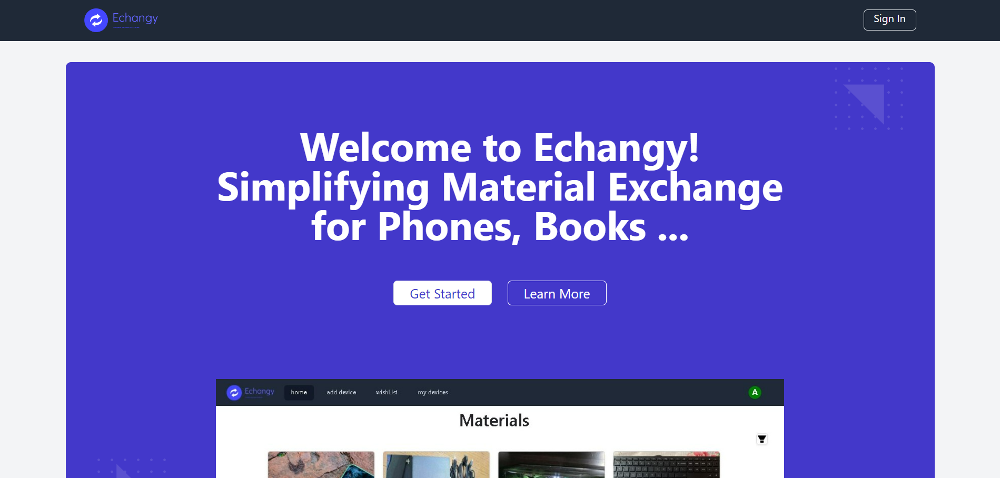

# Echangy - Item Exchange Platform

Echangy is your go-to platform for seamless device and item exchanges across Tunisia. Whether it's upgrading your phone, trading in your laptop, or swapping books, Echangy simplifies it all.

## Features

- Browse and search a wide selection of items.
- Connect with users via phone numbers for exchanges.
- View detailed information about each item.

## Technologies Used

- React.js
- Context API
- Tailwind CSS
- Node.js
- Express.js
- MongoDB

## Installation

1. Clone the repository.
2. Install dependencies using `npm install`.
3. Set up MongoDB.
4. Run the application using `npm start`.

## Usage

- Browse and search for items.
- Connect with users to initiate exchanges.

## Contributing

We welcome contributions to improve Echangy. Feel free to submit pull requests or open issues.

## License

This project is licensed under the [MIT License].

Visit the live app at: [Echangy](https://echangy.netlify.app/)
